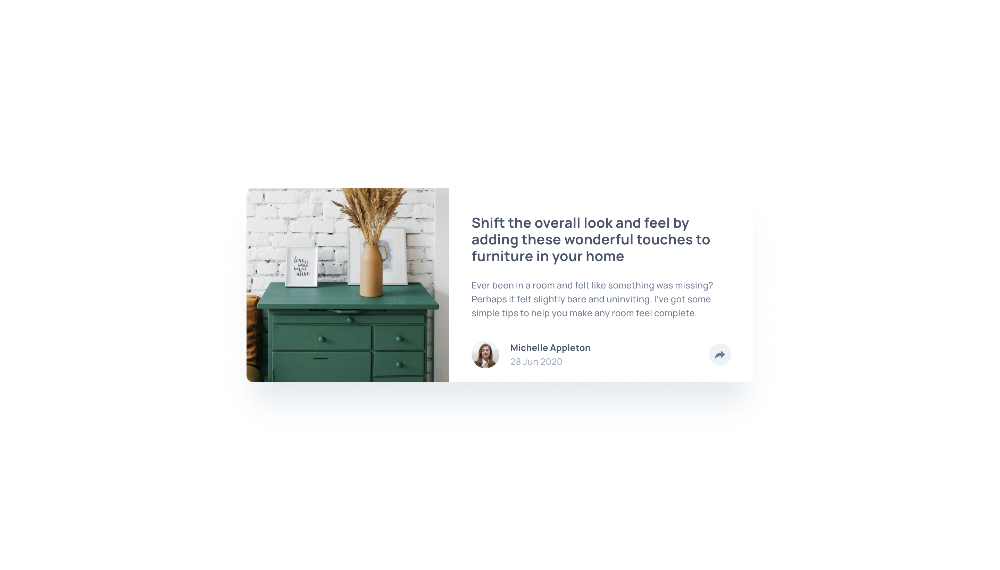
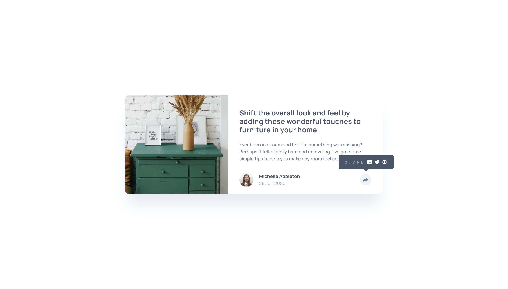
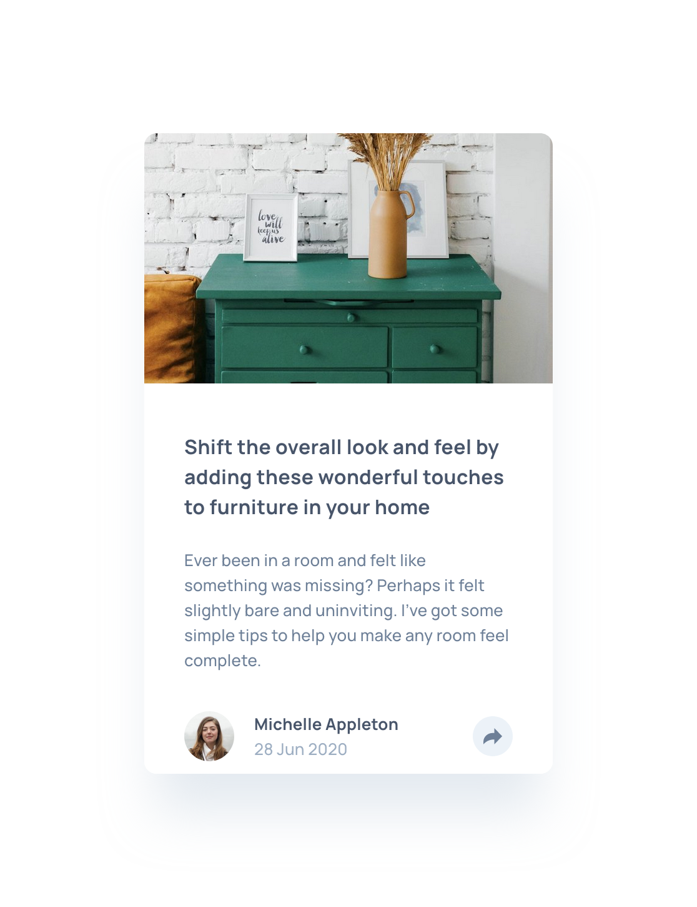
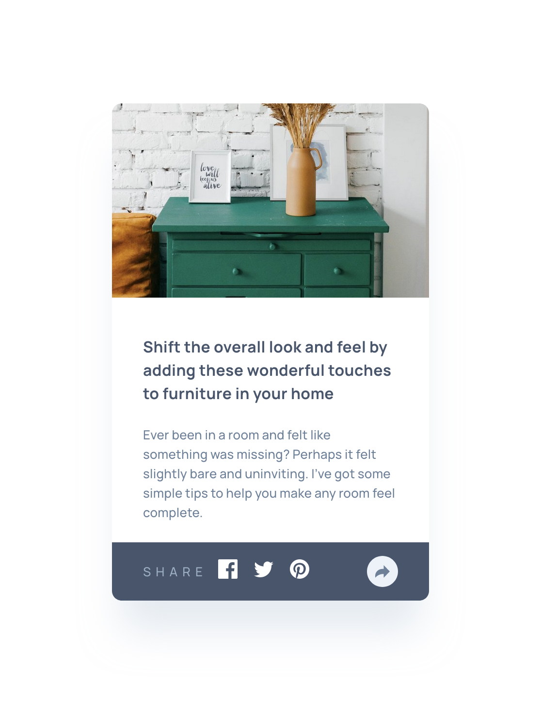

# Frontend Mentor - Article preview component solution

This is a solution to the [Article preview component challenge on Frontend Mentor](https://www.frontendmentor.io/challenges/article-preview-component-dYBN_pYFT). Frontend Mentor challenges help you improve your coding skills by building realistic projects.

## Table of contents

- [Overview](#overview)
  - [The challenge](#the-challenge)
  - [Screenshot](#screenshot)
  - [Links](#links)
- [My process](#my-process)
  - [Built with](#built-with)
- [Author](#author)

## Overview

### The challenge

Users should be able to:

- View the optimal layout for the component depending on their device's screen size
- See the social media share links when they click the share icon

### Screenshots

### Links

- [Github Solution](https://github.com/AliceMenzie/fm-article-preview-component)

- [Live Site](https://alicemenzie.github.io/fm-article-preview-component/)

## My process

### Built with

- CRA
- TypeScript
- CSS in JSS
- Flexbox
- Mobile-first workflow
- [Storybook](https://storybook.js.org/) - UI component Builder
- [React](https://reactjs.org/) - JS library
- [Styled Components](https://styled-components.com/) - For styles

## Author

- Website - [Alice Menzie](https://alicemenzie.dev/)
- Frontend Mentor - [@AliceMenzie](https://www.frontendmentor.io/profile/AliceMenzie)
- Github - [AliceMenzie](https://github.com/AliceMenzie)
